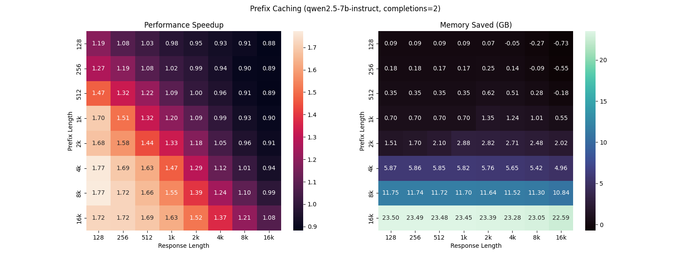

# Benchmark

This benchmark compares different data packing strategies for training transformers, with a focus on a technique called prefix sharing. Prefix sharing is particularly effective in scenarios where we have sequences with repetitive prefixes, such as in reinforcement learning from human feedback (RLHF) or when generating multiple completions for the same prompt. By sharing the computation for the common prefix, we can achieve significant speedups and memory savings.

## Preference optimization

The image below shows the performance and memory saved by using prefix sharing relative to the [Flash Attention SDPA](https://docs.pytorch.org/docs/stable/generated/torch.nn.functional.scaled_dot_product_attention.html#torch.nn.functional.scaled_dot_product_attention) baseline. We use 2 completions per prompt to simulate the standard preference optimization settings (e.g. DPO):



### Benchmark Settings

- **Model:** Qwen2.5-7B-Instruct
- **Hardware:** 1x H200 NVL GPU
- **Data:** Random data with prompt and completion lengths ranging from 128 to 16k tokens. Batch size = 3, Number of completions per prompt = 2, no padding.
- **Benchmark Operation:** Time and memory for the forward and backward pass of the negative log-likelihood (NLL) loss.
- **Features:** Using `torch.compile`, gradient checkpointing and cut cross entropy (https://arxiv.org/abs/2411.09009, https://github.com/apple/ml-cross-entropy) to optimize memory usage.

## Implementation

```py
def build_doc_maskmod_prefix(
    mask_doc_ids: torch.Tensor, prefix_docs: torch.Tensor
) -> MaskMod:
    """Mask for packed batch of the form: [A, a1, a2, a3, B, b1, b2, b3, ...]"""

    def doc_mask_mod(
        batch: torch.Tensor,
        head: torch.Tensor,
        query_index: torch.Tensor,
        kv_index: torch.Tensor,
    ) -> torch.Tensor:

        # We are in the same prompt group, e.g. [A, a1, a2, a3]
        same_doc = mask_doc_ids[query_index] == mask_doc_ids[kv_index]

        # We are in the same completion or the prefix prompt.
        # this relies on the document mask, as all prompts have prefix doc id = 0
        same_completion = prefix_docs[query_index] == prefix_docs[kv_index]

        # kv is at a prompt, assuming document mask is also applied and true
        # this will be the shared prefix prompt.
        kv_in_prefix_prompt = prefix_docs[kv_index] == 0

        return same_doc & (kv_in_prefix_prompt | same_completion)

    return doc_mask_mod
```

## Other prefix sharing implementations 

Implementations built on top of/compatible with [transformers](https://github.com/huggingface/transformers/):
- https://github.com/li-plus/flash-preference/
- https://github.com/frankxwang/dpo-prefix-sharing/